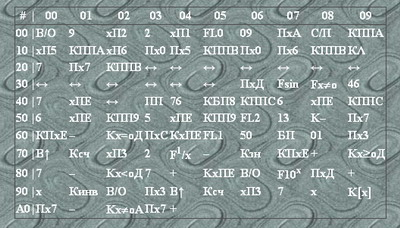

Program format
--------------

Originally programs for calculators were written in table format, like the next image shows.

Top row and leftmost column contain address of the command and commands are written in rows of 10.

Program file format supported by `mk54` requires one command per line, for example following program

|      |  00   |  01   |   02 |   03 |  04  |  05  |  06  |  07 |  08 |  09  |
|:----:|:-----:|:-----:|:----:|:----:|:----:|:----:|:----:|:---:|:---:|:----:|
|   00 |   В/О |    9  |  хП2 |   2  |  хП1 |  FL0 |  09  | ПхА | С/П | КППА |
|   10 |   хП5 |  КППА |  хП6 |  Пх0 |  Пх5 | КППВ |      |     |     |      |

Should be written as

    00. В/О
    01. 9 
    02. хП2
    03. 2 
    04. хП1 
    05. FL0
    06. 09
    07. ПхА
    08. С/П
    09. КППА
    10. хП5
    11. КППА
    12. хП6
    13. Пх0 
    14. Пх5
    15. КППВ

Command address is optional and is ignored by parser. If used, address must be separated from command with `.` (dot).