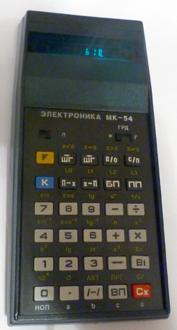

MK-54
=====

Preface
-------

When I was a boy I had a dream. My dream was to own a programmable calculator.
My estranged father had one and I loved to play with it when I was visiting.

It was MK-54, a bit modernized version of even older programmable calculator named B3-34, released in 1980.

 

That was as close to computer as average person could get in late 80s in the USSR.

Trying to program it taught me several things: debugging by reading hex codes, reverse polish notation and
importance of memory conservation.

My dreams came true, I got a MK-52, which was probably the best of the series and it helped me with
my math assignments during my 9th year. Soon enough I got a PC, but that strange beast 
always remained in my memory.

This project is my attempt to build a translator from MK-series binary code into java bytecode.

Its main idea is to play with bytecode generation and to remember my youth :)

Limitations
-----------

I'm not going to support all the weird Еггогs and various undocumented behaviour. Only documented commands, sorry.

In case you want real hardware-level emulator of calculators built with soviet 145-series chips see [here](http://www.emulator3000.org/c3.htm).

It is possible to stop program execution using `С/П` command and request user to perform some actions, say enter new 
parameter in X register or store something to memory register or change `rad-grad-deg` switch. As `mk54` is not an 
emulator there will be no support for interactive mode. `С/П` command will terminate running program. 

Implementation details
----------------------

MK-series worked with decimal floating numbers represented as 8-digit mantissa and 2-digit power in base of 10. My goal
is to generate self-contained `.class` file that can be run with JVM so mk54 will use Java `float` type for all 
calculations. This should not cause any problems with simple programs, but more sophisticated programs abusing number 
overflow or relying on floating point number representation will fail.

[Hex code mapping](docs/hexcode.md) to MK-series 8-segment display symbols.

Some details about Java [Byte code generation](docs/code_generation.md)